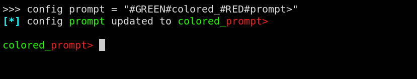

# Interpolation

An interface for adding points and generating an interpolation
function for them. Points can be entered manually, or throw files (txt or csv).

This script [interactive_main.py](./interactive_main.py) is mainly developed
for UI and ease of use.

features (not about interpolation itself):
- Coloring output (only if the terminal supports colors).
- Command completion using TAB.
- Ability to add points from files and store them into files.
- Ability to approximate the output result in decimal form, as it is default
to fraction form.
- Ability to set config to change the behavior of the app
  - `show-time`: shows how much time it took for the last command (default: `False`).
  - `show-colors`: shows the colors on output (default: `True` if supported).
  - `prompt`: change the prompt of the app (default: `">>>"`).
  - `precision`: precision when approximating decimal results (default: `6`).
- Robust design and it should not crash, but report respective errors to the user.
- Ability to execute a shell command using `!` before the command.
- Ability to quit using `Ctrl-D` or `Ctrl-C`. similar to `iPython`.

### screenshots
Start

Help

Use case

Config prompt (colored)

Executing shell command

### Notes
Any notes, edits or issues are welcomed at pull requests and issues section